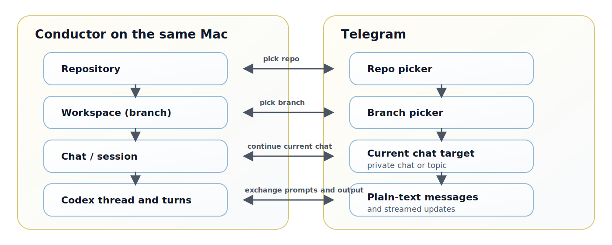

# Telegram Conductor Bridge

Use Telegram as a mobile control surface for the Conductor instance already running on your Mac.

Browse repos, switch branches, resume Codex or Claude chats, create new chats and workspaces, and follow streamed output from your phone without screen sharing or remote desktop.

This bridge is local-first: it must run on the same Mac that already has Conductor installed and initialized. It reads the local Conductor database and launches the local Codex and Claude Code binaries from that machine. It is not a remote bridge for controlling another computer's Conductor instance.

## Why Use It

- Continue existing Conductor chats from Telegram
- Browse repos, branches, workspaces, and chats without opening Conductor
- Create new chats and new workspaces from Telegram
- In forum-enabled supergroups, give each Conductor chat its own Telegram topic
- Stream assistant output as it arrives
- Queue follow-up prompts and interrupt active turns
- Inspect status and recent context without leaving Telegram

## Install Without Cloning the Repo

Install the published CLI package:

```bash
npm install -g conductor-tg
```

Create the default config file:

```bash
conductor-tg setup
```

The setup command writes the config to:

```text
~/Library/Application Support/conductor-tg/.env
```

It asks for at least these two values:

- `TELEGRAM_BOT_TOKEN`
- `TELEGRAM_ALLOWED_CHAT_IDS`

Set `TELEGRAM_ALLOWED_CHAT_IDS` to the Telegram chat IDs that may use the bridge. Separate multiple IDs with commas.

If you prefer manual editing instead of the interactive setup flow, run:

```bash
conductor-tg init
```

That command only creates the template file. After that, open `~/Library/Application Support/conductor-tg/.env` and fill in the required values yourself.

Then start the bridge:

```bash
conductor-tg
```

The packaged install stores its local state DB at:

```text
~/Library/Application Support/conductor-tg/bridge.db
```

If you want to keep the config somewhere else, set `BRIDGE_ENV_PATH` before launching the bridge.

## Quick Start From Source

The fastest path is a private chat with the bot. Start there first. Add a forum-enabled supergroup later if you want one Telegram topic per Conductor chat.

1. Install dependencies

```bash
npm install
```

2. Copy the environment template

```bash
cp .env.example .env
```

3. Create a Telegram bot with `@BotFather`, then put the token into `.env` as `TELEGRAM_BOT_TOKEN`
4. Open a private chat with the bot and send `/start`
5. Fetch your chat ID with `getUpdates`, then put it into `.env` as `TELEGRAM_ALLOWED_CHAT_IDS`
6. Start the bridge

```bash
npm start
```

7. In Telegram, send `/start`, choose a repo, choose a branch, choose a chat, then send plain text

If you want the detailed Telegram setup, group setup, or topic mode, see the sections below.

## Requirements

- The bridge must run on the same Mac where Conductor is already installed
- Conductor must have been opened at least once on that Mac
- Node.js 22 or newer must be installed
- The local Conductor DB must exist at:
  `~/Library/Application Support/com.conductor.app/conductor.db`
- The local Codex binary must exist at:
  `~/Library/Application Support/com.conductor.app/bin/codex`
- The local Claude Code binary must exist at:
  `~/Library/Application Support/com.conductor.app/bin/claude`
- A Telegram bot token must be available
- In private chats, Telegram administrator permissions are not required
- In a forum-enabled Telegram supergroup, the bot should be promoted to administrator with at least `Manage Topics` enabled

If you use the bridge in a group without topics, promoting the bot to administrator is still recommended so it can receive normal group messages reliably.

## Conductor <-> Telegram Mapping



- A Conductor repository is the repo you pick in Telegram
- A Conductor workspace is the branch context you pick in Telegram
- A Conductor session is the current chat you continue from Telegram
- In forum-enabled supergroups, one Conductor chat is bound to one dedicated Telegram topic
- In private chats, or in chats without topics, the conversation stays in the current Telegram chat instead

## Telegram Setup

Menu names vary slightly between Telegram macOS, Desktop, iOS, and Android, but the flow is the same.

### 1. Create the bot

1. Open Telegram and start a chat with `@BotFather`
2. Send `/newbot`
3. Choose a display name for the bot
4. Choose a username for the bot. Telegram bot usernames normally end with `bot`
5. Copy the token that `@BotFather` returns
6. Put that token into `.env` as `TELEGRAM_BOT_TOKEN`

### 2. Choose where you want to use the bridge

Private chat is the simplest option. Forum-enabled supergroup is the best option if you want one topic per Conductor chat.

Private chat:

1. Open a 1:1 chat with the bot
2. Send `/start` once. Telegram bots cannot initiate a private chat on their own

Group or supergroup:

1. Create a new Telegram group and add the bot as a member
2. If you want one Conductor chat per Telegram topic, enable `Topics` in the group settings. Telegram uses a forum-enabled supergroup for this mode
3. Promote the bot to administrator from the group's `Administrators` settings
4. For topic mode, enable at least `Manage Topics`
5. Send `/start` in the main group chat after the bot has been added

### 3. Find the chat IDs for `TELEGRAM_ALLOWED_CHAT_IDS`

1. If the bridge is already running, stop it first so it does not consume updates before you inspect them
2. Send `/start` in each private chat or group that you want to allow
3. Fetch recent updates from the Bot API

```bash
curl "https://api.telegram.org/bot$TELEGRAM_BOT_TOKEN/getUpdates"
```

4. Look for the latest `message.chat.id` value for each chat you just used
5. Private chat IDs are positive integers
6. Group and supergroup IDs are negative integers. Supergroups commonly start with `-100`
7. Put the allowed IDs in `.env`, separated by commas

Example:

```bash
TELEGRAM_ALLOWED_CHAT_IDS=123456789,-1009876543210
```

## Configuration

At minimum, set these variables in `.env`:

```bash
TELEGRAM_BOT_TOKEN=your_bot_token_here
TELEGRAM_ALLOWED_CHAT_IDS=123456789,-1009876543210
```

Useful defaults:

- `BRIDGE_DB_PATH` defaults to `.context/bridge.db`
- `CONDUCTOR_DB_PATH` defaults to `~/Library/Application Support/com.conductor.app/conductor.db`
- `CODEX_BIN` defaults to `~/Library/Application Support/com.conductor.app/bin/codex`
- `CLAUDE_BIN` defaults to `~/Library/Application Support/com.conductor.app/bin/claude`
- `WORKSPACES_ROOT` defaults to `~/conductor/workspaces`

The current version creates `.context/` on startup, so you do not need to create it in advance.

## Run

Run the bridge on the same Mac where Conductor is installed:

```bash
conductor-tg
```

If you are working from a source checkout instead of the published package:

```bash
npm start
```

Development mode from source:

```bash
npm run dev
```

On startup the bridge calls Telegram `setMyCommands`, so the supported slash commands also appear in Telegram's command picker.

## First Successful Flow

1. Open a private chat with the bot in Telegram, or a forum-enabled supergroup where the bot is present
2. Send `/start`
3. Tap `Switch Repo`
4. Select a repo
5. Tap `Switch Branch`
6. Select a branch in that repo
7. Tap `Switch Chat`
8. Select an existing chat
9. Send plain text to continue the current chat

In topic-enabled supergroups, the bridge opens that chat's dedicated topic and streams follow-up output there.

Create a new chat:

1. Select a repo and branch first
2. Tap `New Chat Here` or send `/new`
3. Your next message creates a new Conductor chat and switches to it automatically
4. If the current Telegram conversation supports topics, the bridge also creates a dedicated topic for that new chat and sends follow-up updates there
5. Existing chats reuse their previously bound topic, so one Conductor chat stays attached to one Telegram topic

Create a new workspace:

1. Select a repo and branch first, or open a repo's branch list
2. Tap `New Workspace` or `New Workspace Here`, or send `/new_workspace`
3. Send the branch name as your next message, for example `berlin` or `feature/demo`
4. The bridge creates a git worktree, writes the Conductor workspace row, and switches you to the new branch

## Telegram Commands

- `/start` or `/home`: return to the home screen
- `/repos` or `/workspaces`: choose a repo
- `/branches`: choose a branch
- `/chats` or `/sessions`: choose a chat
- `/status`: open or refresh the current chat's status panel
- `/stop`: interrupt the current turn
- `/queue`: inspect the current chat queue
- `/context [N]`: open a paginated single-message context viewer with older, newer, refresh, and close controls
- `/new`: make the next plain-text message create a new chat on the current branch
- `/new_workspace`: make the next plain-text message create a new workspace in the current repo
- `/help`: show help

## Output Model

- `/status` creates or refreshes a reusable status panel when you want a compact status view
- `/context [N]` opens a separate context preview card; paging and refresh actions only update that single message
- In topic-enabled chats, each Conductor chat streams as a normal assistant message inside its dedicated topic instead of using the status panel
- The context preview stays scoped to the current topic instead of the whole Telegram chat
- Dedicated topics stay locked to their current Conductor chat; use the main chat to switch repos, branches, or chats
- Both the status panel and the context preview can be closed to keep the Telegram chat tidy

## Keep It Running on macOS

If you want the bridge to stay available after login, use a user `LaunchAgent` via `launchd`.

`Launchpad` is only an app launcher. It does not keep a CLI process alive.

Amphetamine can help prevent the Mac from sleeping while the bridge is running, but use a user `LaunchAgent` via `launchd` if you want the bridge to start automatically after login.

If you install the published CLI package, point `launchd` at the `conductor-tg` executable. It reads config from `~/Library/Application Support/conductor-tg/.env` by default, so it does not need to start from a repo checkout.

If you run from a source checkout instead, start the process from the repo root so it can find `.env` and `.context/`.

If your Node.js installation only exists in an interactive shell setup such as `nvm`, `launchd` may not see it.

## Common Setup Issues

- `Unauthorized account. Access to Conductor is disabled.`: the current Telegram chat ID is missing from `TELEGRAM_ALLOWED_CHAT_IDS`
- The bot replies to `/start` but not to plain text in a group: use a private chat first, or promote the bot to administrator in the group
- A dedicated topic is not created for a new chat: make sure the chat is a forum-enabled supergroup and the bot has `Manage Topics`
- The bridge starts but Telegram polling keeps returning `401`: the bot token is invalid

## Notes and Limitations

- The current version supports a single user across the allowed Telegram chats
- New chats inherit the active workspace's preferred agent. Existing Claude workspaces continue as Claude; otherwise new chats default to Codex
- Claude chats support queueing, streaming output, and interrupt
- Plan approval, plan feedback, and request-user-input replies are currently Codex-only bridge features
- The process will not start if `TELEGRAM_BOT_TOKEN` is not set
